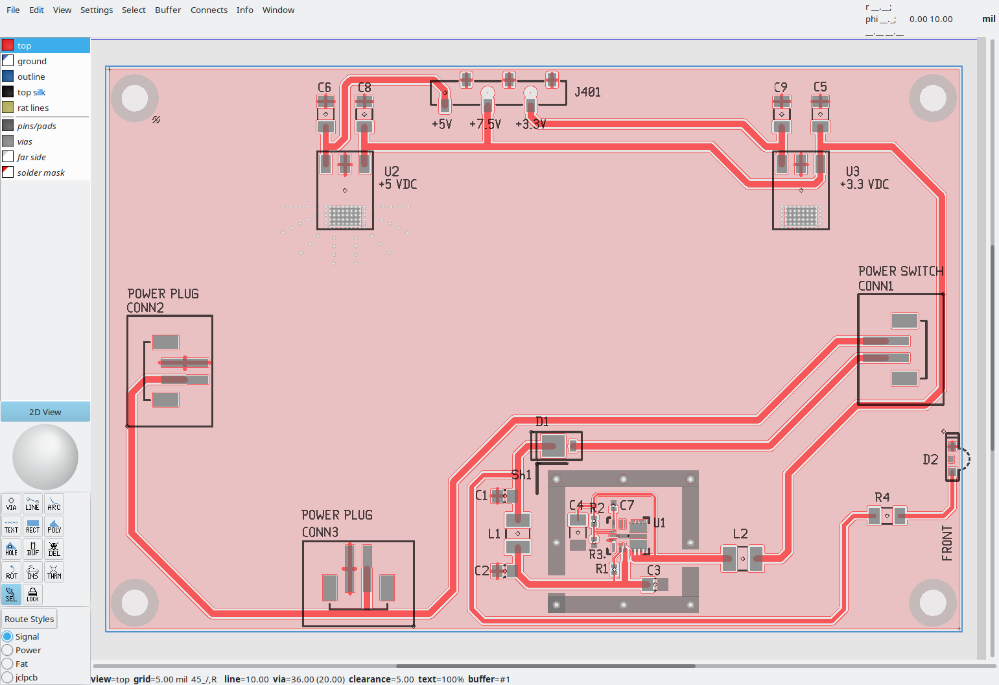
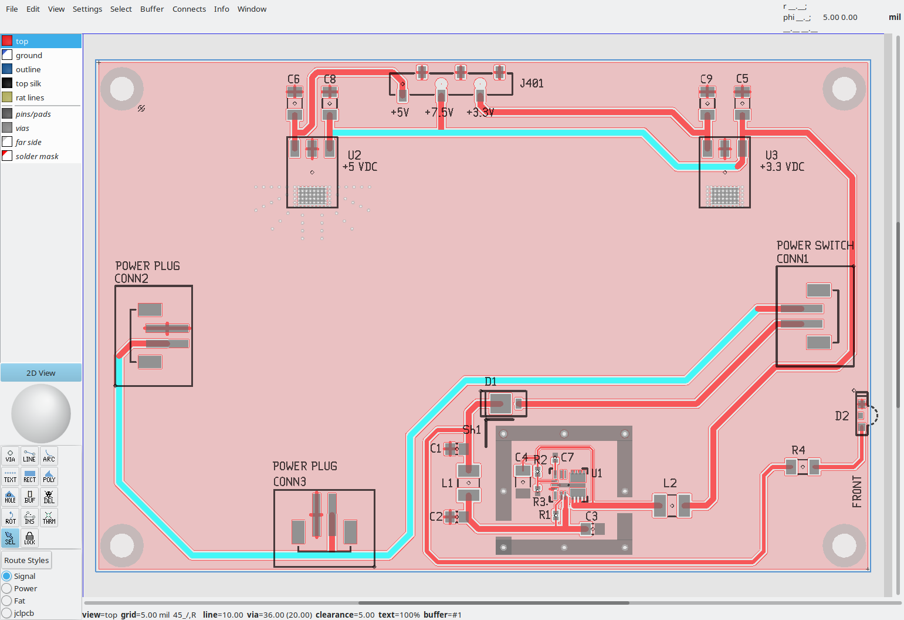
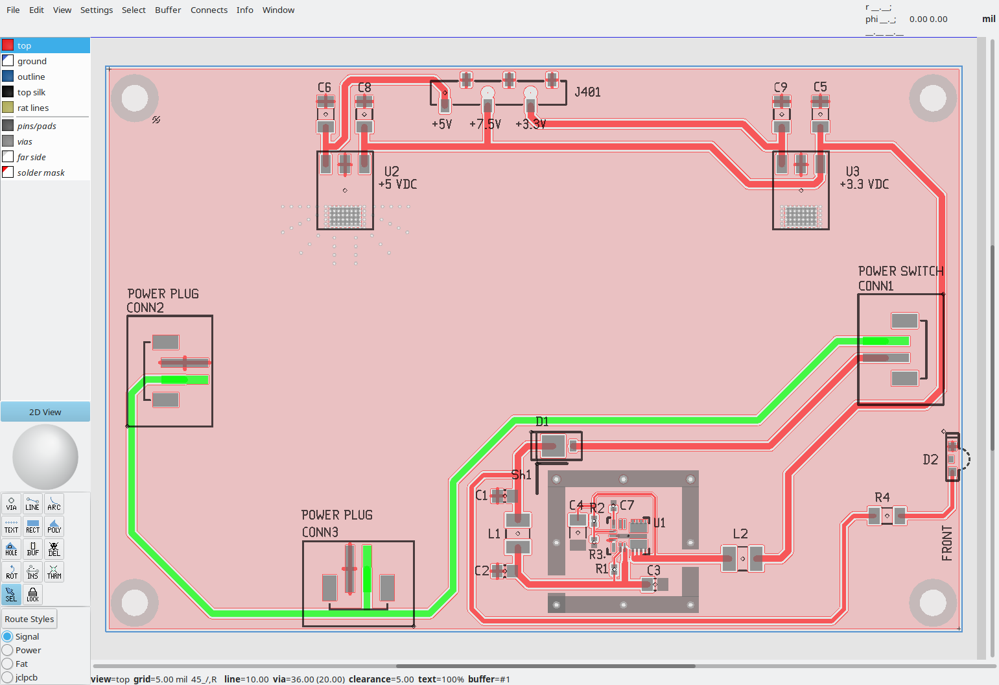
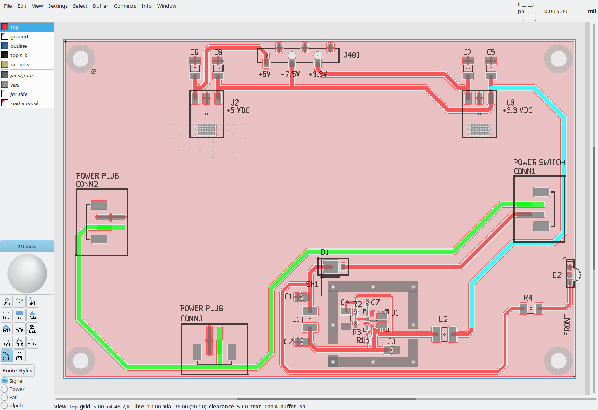

# PCB_Trace_Lengths
This program, designed specifically for gEDA PCB users, dynamically reports the lengths of traces marked as 'selected' or 'connected'. By ensuring that traces like spi_clock and spi_data are of equal length, the program helps maintain precise timing for data clocking—crucial for optimal circuit performance. The script actively watches for any changes in your ASCII formatted .pcb file which gEDA uses for printed circuit board designs. Whenever it detects updates, it calculates the total length of the corresponding traces, instantly providing you with the updated measurements.

## Libraries Used:
- **re**: Used for regular expression operations.
- **pyinotify**: Monitors file and directory changes in real-time on Linux.
- **time**: Introduces delays.

## Class `EventHandler`
This class inherits from `pyinotify.ProcessEvent` and handles events related to file modifications.

- `__init__(self, filename)`: Initializes instance with filename to watch, an empty dictionary for saved files, and a variable to store the last printout.
- `process_IN_MODIFY(self, event)`: Called when file is modified. Introduces a small delay ensuring all data is written before processing.
- `process_file(self)`: Processes the `.pcb` file, extracts and calculates trace lengths, then prints results if different from last printout.
- `parse_coordinates(self, line)`: Extracts coordinates from a line and converts to standard unit (mils).
- `line_length(self, x1, y1, x2, y2)`: Calculates line segment length using Pythagorean theorem.
- `find_connected_line(self, lines, x, y)`: Searches for a line connecting to point `(x, y)`.
- `get_trace(self, lines, start_line)`: Constructs a trace from lines starting with a given line.

## Function `measure_selected_lines`
Sets up inotify watch to monitor file modifications.

- Creates a `WatchManager` for managing file/directory watches.
- Instantiates `EventHandler` with file to watch.
- Uses `Notifier` for event loop and dispatching to handler.
- Adds file to watch list with `IN_MODIFY` flag (notifying only on modifications).
- Starts notifier's loop, awaiting events.

## Main Block
Checks for filename as command-line argument. If provided, calls `measure_selected_lines` with filename. Otherwise, prints error message.

## Summary
The script monitors a `.pcb` file for any changes. On modification, it finds traces marked as "found" or "selected", computes their lengths, and prints a new result if the line lengths differ from previous output.


## Example

`trace_len.py` is a tool designed for monitoring the length of one or more traces during the layout of tracks in the gEDA PCB program. Although gEDA PCB does not inherently support monitoring trace lengths, this script utilizes available features to perform this function effectively.

**Features of gEDA PCB for Monitoring:**
- **Manual Selection:** You can manually select each portion of a trace that you want to monitor.
- **Automatic Discovery:** Utilize the ‘F’ key while hovering over a trace to find and select everything connected to that trace. Note that using the ‘F’ key will identify all branches connected to the trace, which is most useful for single, uninterrupted lines.

**Functionality:**
- Once you have selected all relevant lines and saved the changes, `trace_len.py` will detect this and calculate the lengths of all lines marked as ‘selected’ and ‘found’.
- The script determines which line sections are connected end-to-end and sums their lengths. For instance, if you select 4 connected sections of one line and 13 connected sections of another, the app will report two separate line lengths. If the selected lines split at any point, the app will report the number of distinct lines as 3 or more.

**Usage:**
To operate the app, use the following command:
```
python3 trace_len.py <path_to_pcb_file.pcb>
```

**Operational Notes:**
- When started, the program will initially be in a waiting state.
- In gEDA’s PCB design software, use shift-click to select multiple connected traces.
- To compare the lengths of two or more lines, continue connecting another set of line sections. Upon saving your changes, the app will report the lengths of as many line sections as you have selected.
- If no selections are made or cleared, and you attempt to save the file repeatedly, the output will remain unchanged. The program only updates the line lengths if there are changes to the selections.
- To exit the program, press Ctrl-C.

**None of the traces have been selected**


**Using shift_click to select traces**


**Using hover-f to select traces**


**Using both, hover-f and shift-click, to select traces**


If you don't make or clear any selections and you try to save the file repeatedly the output of the
program won't change. It will only update the line lengths if you have changed something.

### Example output from 'Using both, hover-f and shift-click, to select traces'
Upon saving the file in gEDA PCB.
```
~/projects/python/PCB_Trace_Lengths$ python3 trace_len.py ../../Vapor\ Ware\ Inc./Project_#1/Spectrum_Analyzer/Schematics/pwrsupvwi.pcb
 Trace 1:       2798.88 mils
 Trace 2:       5416.95 mils
 Trace 3:       210.00 mils
```
The reason it's showing 3 lengths is that the trace splits under the POWER PLUG footprint.
